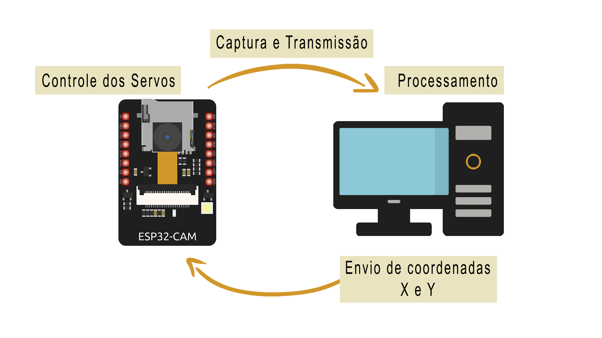
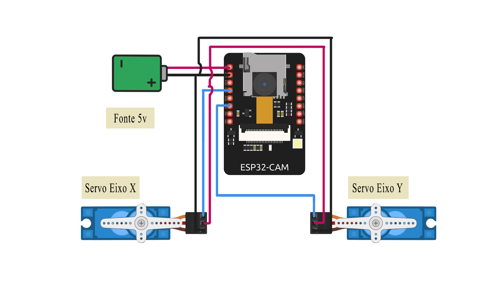

# 👁️ ESP32-CAM TRACKER

Este projeto tem o objetivo de unir o dispositivo ESP32-CAM com o algoritmo YOLO para detectar e rastrear pessoas.

---

## 📝 Resumo

A captura da imagem é feita pelo IoT, que funciona como um servidor.  
O computador acessa o stream de vídeo disponível em `{ip}/stream` e processa a cena utilizando o modelo **YOLOv8n**.  
Caso encontre alguma pessoa, ele retorna um URL contendo os valores X e Y com a localização do objeto, permitindo que o ESP32 mova os servos para centralizar o objeto focal.

---

## 🧩 Esquema Geral

<p align="center">
  
</p>
<p align="center">Fluxo geral do sistema</p>

---

## 🧩 Controle dos Servos 

<p align="center">
  
</p>
<p align="center">Controle dos Servos</p>

---


### 🎥 Vídeo demonstrativo

Confira o vídeo de demonstração do projeto no link abaixo:

👉 [Assista ao vídeo](https://www.youtube.com/seu-video-aqui)

## ⚙️ Como rodar

### 1️⃣ Configurar o ESP32-CAM
1. Instale as bibliotecas necessárias para lidar com o ESP32-CAM no Arduino IDE.  
2. Coloque o ESP32-CAM em **modo bootloader** e faça upload do arquivo `microcontrolador.ino`.  
3. Reinicie o ESP32-CAM.

### 2️⃣ Configurar o ambiente Python
```bash
# Criar e ativar o ambiente virtual
python -m venv trackervenv

# Windows
trackervenv\Scripts\activate

# Linux / macOS
# source trackervenv/bin/activate

### 3 Configurar o ambiente Python
Para testar apenas os servos rodar o código <teste servos>
Para testar a detecção rodar o arquivos deteccao.py

